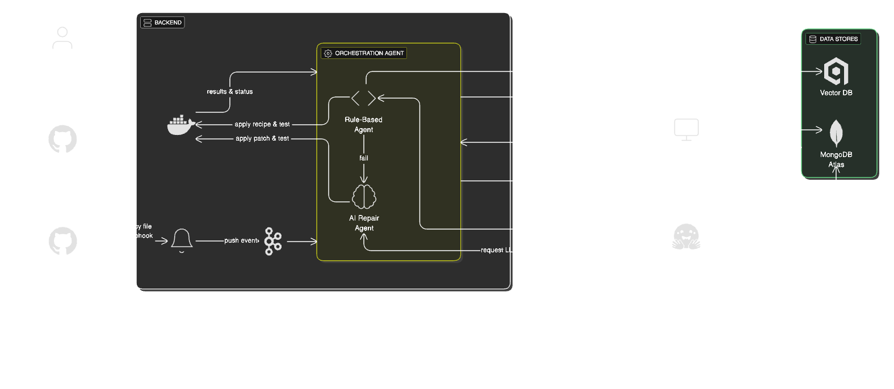

# AURA - Automated Dependency Repair

<div align="center">

**An intelligent system for automated dependency upgrade issue detection and repair using multi-agent AI workflows**

[](https://fastapi.tiangolo.com/)
[](https://react.dev/)
[](https://www.python.org/)
[](https://www.typescriptlang.org/)
[](https://github.com/langchain-ai/langgraph)
[](https://www.mongodb.com/)

</div>

---

## 🌟 Overview

AURA (Automated Upgrade Repair Assistant) is an intelligent system that automatically detects, analyzes, and repairs code issues arising from dependency version upgrades. By leveraging multi-agent AI workflows powered by LangGraph and LLM reasoning, AURA helps development teams maintain their codebases efficiently when dependencies are updated.

### Key Features

- 🤖 **Multi-Agent AI System** - LangGraph-based workflow with specialized agents for analysis and repair
- 🔍 **Intelligent Issue Detection** - Automatic detection of breaking changes from dependency upgrades
- 🛠️ **Automated Code Repair** - AI-powered code fixes with minimal changes
- 🔗 **GitHub Integration** - Seamless integration via GitHub webhooks and OAuth
- 📊 **Change Tracking** - Complete history of detected issues and applied fixes
- 🚀 **Pull Request Automation** - Automatic PR creation with proposed fixes
- 👥 **User Management** - OAuth-based authentication and repository management

---

## 🏗️ Architecture

<div align="center">
  
</div>

The system architecture consists of:

- **Backend**: FastAPI server handling GitHub webhooks and orchestrating the repair workflow
- **Orchestration Agent**: Rule-based agent coordinating the repair process
- **AI Repair Agent**: LLM-powered agent generating code fixes when rule-based approaches fail
- **Data Stores**: Vector DB for semantic search and MongoDB for persistent storage
- **GitHub Integration**: Webhook-driven event processing and automated PR creation

### Technology Stack

**Backend:**
- FastAPI - Modern, high-performance Python web framework
- LangGraph - Multi-agent workflow orchestration
- LangChain - LLM integration and tooling
- MongoDB (Motor) - Async database operations
- PyGithub - GitHub API integration
- JWT - Secure authentication

**Frontend:**
- React 19 - Modern UI framework
- TypeScript - Type-safe development
- Vite - Fast build tooling
- React Router - Client-side routing
- Axios - HTTP client

**AI/ML:**
- Groq/OpenAI - LLM providers
- LangGraph - Agent workflow management
- Tree-sitter - Code parsing
- DSPy - LLM pipeline optimization

---

## 📁 Project Structure

```
aura/
├── backend/                    # FastAPI backend application
│   ├── app/
│   │   ├── main.py            # Application entry point
│   │   ├── agents/            # LangGraph multi-agent system
│   │   │   ├── workflow.py    # Agent workflow orchestration
│   │   │   ├── service.py     # Agent service layer
│   │   │   ├── tools.py       # Agent tools (Git, Docker, LSP)
│   │   │   └── callback.py    # Event callbacks
│   │   ├── api/
│   │   │   └── routes/        # API endpoints
│   │   │       ├── auth.py    # GitHub OAuth
│   │   │       ├── webhook.py # GitHub webhooks
│   │   │       ├── repositories.py
│   │   │       ├── changes.py
│   │   │       └── users.py
│   │   ├── auth/              # Authentication logic
│   │   ├── core/              # Configuration
│   │   ├── database/          # MongoDB connection
│   │   ├── models/            # Database models
│   │   ├── repositories/      # Data access layer
│   │   ├── schemas/           # Pydantic schemas
│   │   ├── services/          # Business logic
│   │   ├── masterthesis/      # Research components
│   │   │   ├── agent/         # Specialized agents
│   │   │   ├── ast/           # AST parsing
│   │   │   ├── llm/           # LLM utilities
│   │   │   └── evaluation/    # Evaluation metrics
│   │   └── utils/             # Helper utilities
│   └── requirements.txt       # Python dependencies
│
└── frontend/                  # React + TypeScript frontend
    ├── src/
    │   ├── components/        # React components
    │   │   ├── auth/          # Auth components
    │   │   ├── changes/       # Change list & detail
    │   │   ├── repository/    # Repository management
    │   │   └── common/        # Shared components
    │   ├── pages/             # Page components
    │   ├── services/          # API clients
    │   ├── context/           # React context
    │   ├── hooks/             # Custom hooks
    │   ├── types/             # TypeScript types
    │   ├── utils/             # Utility functions
    │   ├── router/            # Routing configuration
    │   └── config/            # App configuration
    └── package.json           # Node dependencies
```

---

## 🚀 Getting Started

### Prerequisites

- Python 3.10 or higher
- Node.js 18 or higher
- MongoDB instance (local or cloud)
- GitHub OAuth App credentials
- LLM API key (Groq or OpenAI)

### Environment Setup

1. **Clone the repository:**
   ```bash
   git clone https://github.com/ManethNin/AURA.git
   cd aura
   ```

2. **Backend setup:**
   ```bash
   cd backend
   python -m venv venv
   source venv/bin/activate  # On Windows: venv\Scripts\activate
   pip install -r requirements.txt
   ```

3. **Create `.env` file in `backend/` directory:**
   ```env
   # Application
   APP_NAME=AURA
   DEBUG=True
   
   # MongoDB
   MONGODB_URL=mongodb://localhost:27017
   MONGODB_DB_NAME=aura
   
   # GitHub OAuth App
   GITHUB_CLIENT_ID=your_github_client_id
   GITHUB_CLIENT_SECRET=your_github_client_secret
   GITHUB_APP_ID=your_github_app_id
   GITHUB_PRIVATE_KEY=your_private_key
   GITHUB_WEBHOOK_SECRET=your_webhook_secret
   
   # JWT
   JWT_SECRET_KEY=your_secret_key_here
   JWT_ALGORITHM=HS256
   ACCESS_TOKEN_EXPIRE_MINUTES=30
   
   # LLM Provider
   GROQ_API_KEY=your_groq_api_key
   # or
   OPENAI_API_KEY=your_openai_api_key
   ```

4. **Frontend setup:**
   ```bash
   cd ../frontend
   npm install
   ```

5. **Configure frontend API endpoint in `frontend/src/config/api.config.ts`:**
   ```typescript
   export const API_BASE_URL = 'http://localhost:8000';
   ```

### Running the Application

1. **Start MongoDB** (if running locally):
   ```bash
   mongod
   ```

2. **Start the backend:**
   ```bash
   cd backend
   source venv/bin/activate
   uvicorn app.main:app --reload --host 0.0.0.0 --port 8000
   ```

3. **Start the frontend:**
   ```bash
   cd frontend
   npm run dev
   ```

4. **Access the application:**
   - Frontend: http://localhost:5173
   - Backend API: http://localhost:8000
   - API Documentation: http://localhost:8000/docs

---

## 🔧 Configuration

### GitHub Integration

1. **Create a GitHub OAuth App:**
   - Go to GitHub Settings → Developer settings → OAuth Apps
   - Set callback URL to: `http://localhost:5173/auth/callback`

2. **Create a GitHub App (for webhooks):**
   - Go to GitHub Settings → Developer settings → GitHub Apps
   - Enable webhook and set URL: `http://your-domain.com/webhook/github`
   - Subscribe to push events
   - Generate and download private key

3. **Configure webhook endpoint:**
   - Use ngrok or similar tool for local development
   - Update webhook URL in GitHub App settings

### LLM Provider Setup

AURA supports multiple LLM providers:

- **Groq** (Recommended for speed): Set `GROQ_API_KEY`
- **OpenAI**: Set `OPENAI_API_KEY`

---

## 📖 Usage

### Workflow

1. **Authenticate** - Sign in with GitHub OAuth
2. **Connect Repository** - Select repositories to monitor
3. **Automatic Detection** - AURA monitors commits for dependency changes
4. **AI Analysis** - Multi-agent system analyzes breaking changes
5. **Automated Repair** - AI generates fixes with minimal code changes
6. **Review & Merge** - Review proposed changes via pull requests

### Multi-Agent System

AURA uses a sophisticated multi-agent workflow:

- **Analyzer Agent** - Detects and analyzes dependency issues
- **Repairer Agent** - Generates code fixes
- **Verification Agent** - Validates proposed changes
- **Git Agent** - Manages repository operations
- **Docker Agent** - Handles build and test environments
- **LSP Agent** - Provides code intelligence

---

## 🛠️ Development

### Backend Development

```bash
cd backend
source venv/bin/activate
uvicorn app.main:app --reload
```

### Frontend Development

```bash
cd frontend
npm run dev
```

### Running Tests

```bash
# Backend tests
cd backend
pytest

# Frontend tests
cd frontend
npm run test
```

### Code Quality

```bash
# Backend linting
cd backend
flake8 app/

# Frontend linting
cd frontend
npm run lint
```

---

## 📊 API Documentation

Once the backend is running, visit:
- **Swagger UI**: http://localhost:8000/docs
- **ReDoc**: http://localhost:8000/redoc

### Key Endpoints

- `POST /auth/github` - GitHub OAuth login
- `GET /auth/callback` - OAuth callback handler
- `GET /repositories` - List user repositories
- `POST /repositories/{repo_id}/analyze` - Trigger analysis
- `GET /changes` - List detected changes
- `POST /webhook/github` - GitHub webhook handler

---

## 🤝 Contributing

Contributions are welcome! Please follow these steps:

1. Fork the repository
2. Create a feature branch (`git checkout -b feature/amazing-feature`)
3. Commit your changes (`git commit -m 'Add amazing feature'`)
4. Push to the branch (`git push origin feature/amazing-feature`)
5. Open a Pull Request

---

## 📝 License

This project is part of a master's thesis research. Please contact the author for licensing information.

---

## 👤 Author

**Maneth Ninduwara**

- GitHub: [@ManethNin](https://github.com/ManethNin)
- Repository: [AURA](https://github.com/ManethNin/AURA)

---

## 🙏 Acknowledgments

- Built with [LangChain](https://github.com/langchain-ai/langchain) and [LangGraph](https://github.com/langchain-ai/langgraph)
- Powered by [FastAPI](https://fastapi.tiangolo.com/) and [React](https://react.dev/)
- Research supported by master's thesis program

---

## 📧 Support

For questions or support, please open an issue on GitHub or contact the author.

---

<div align="center">

**⭐ Star this repository if you find it helpful!**

</div>
